Economía ambiental
================

## Tabla de contenido

  - [Evaluación contingente](#evaluación-contingente).
  - [Costo de vieje](#costo-de-viaje).
  - [Regresión](#regresión).
      - [Lineal](#regresión-lineal).
      - [No Lineal](#regresión-no-lineal).

## Evaluación contingente

``` r
datos<-read.csv2("conting.csv")
str(datos)
```

    ## 'data.frame':    369 obs. of  7 variables:
    ##  $ DAP     : int  1 1 1 0 1 1 1 0 1 0 ...
    ##  $ CANTIDAD: int  4500 4500 3600 4050 4050 2700 1350 2700 3150 4500 ...
    ##  $ INGMEN  : int  1650000 250000 1150000 350000 250000 1550000 1150000 350000 1250000 550000 ...
    ##  $ VISITAS : int  3 4 6 4 1 4 3 3 5 8 ...
    ##  $ CONOCE  : int  1 1 0 1 0 1 1 1 1 0 ...
    ##  $ EDAD    : int  47 40 45 37 37 38 50 29 34 23 ...
    ##  $ AGUA    : int  0 0 0 0 0 0 1 1 0 0 ...

``` r
head(datos,10)
```

    ##    DAP CANTIDAD  INGMEN VISITAS CONOCE EDAD AGUA
    ## 1    1     4500 1650000       3      1   47    0
    ## 2    1     4500  250000       4      1   40    0
    ## 3    1     3600 1150000       6      0   45    0
    ## 4    0     4050  350000       4      1   37    0
    ## 5    1     4050  250000       1      0   37    0
    ## 6    1     2700 1550000       4      1   38    0
    ## 7    1     1350 1150000       3      1   50    1
    ## 8    0     2700  350000       3      1   29    1
    ## 9    1     3150 1250000       5      1   34    0
    ## 10   0     4500  550000       8      0   23    0

``` r
summary(datos)
```

    ##       DAP            CANTIDAD        INGMEN           VISITAS      
    ##  Min.   :0.0000   Min.   : 450   Min.   : 100000   Min.   : 1.000  
    ##  1st Qu.:0.0000   1st Qu.:1350   1st Qu.: 150000   1st Qu.: 1.000  
    ##  Median :1.0000   Median :2700   Median : 350000   Median : 2.000  
    ##  Mean   :0.6802   Mean   :2476   Mean   : 441463   Mean   : 3.575  
    ##  3rd Qu.:1.0000   3rd Qu.:3600   3rd Qu.: 550000   3rd Qu.: 4.000  
    ##  Max.   :1.0000   Max.   :4500   Max.   :2000000   Max.   :98.000  
    ##      CONOCE            EDAD            AGUA       
    ##  Min.   :0.0000   Min.   :20.00   Min.   :0.0000  
    ##  1st Qu.:0.0000   1st Qu.:31.00   1st Qu.:0.0000  
    ##  Median :0.0000   Median :38.00   Median :1.0000  
    ##  Mean   :0.4851   Mean   :39.27   Mean   :0.5068  
    ##  3rd Qu.:1.0000   3rd Qu.:45.00   3rd Qu.:1.0000  
    ##  Max.   :1.0000   Max.   :89.00   Max.   :1.0000

``` r
table(datos$CANTIDAD)
```

    ## 
    ##  450  900 1350 1800 2250 2700 3150 3600 4050 4500 
    ##   37   37   37   37   36   37   37   37   37   37

``` r
sum(is.na(datos$CANTIDAD))
```

    ## [1] 0

``` r
require(lattice)
```

    ## Loading required package: lattice

``` r
xyplot(INGMEN~CANTIDAD,group=DAP,
       data=datos,type="p",auto.key=TRUE)
```

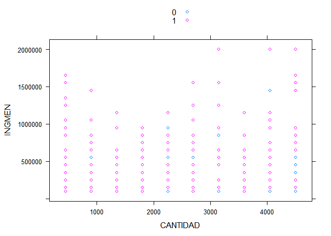<!-- -->

``` r
xyplot(jitter(INGMEN)~jitter(CANTIDAD),group=DAP,
       data=datos,type="p",auto.key=TRUE)
```

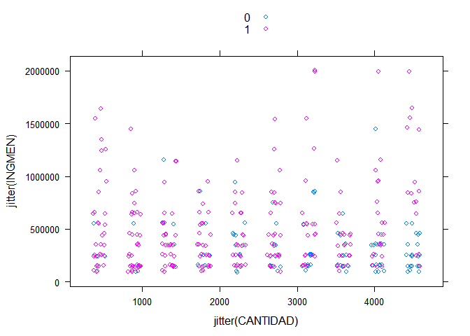<!-- -->

### Regresión logística de DAP versus CANTIDAD ofrecida

``` r
conting.dap.ingreso= glm(DAP ~ log(INGMEN), data=datos, family=binomial(link="logit"))
summary(conting.dap.ingreso) #Null deviance, residual 
```

    ## 
    ## Call:
    ## glm(formula = DAP ~ log(INGMEN), family = binomial(link = "logit"), 
    ##     data = datos)
    ## 
    ## Deviance Residuals: 
    ##     Min       1Q   Median       3Q      Max  
    ## -2.0599  -1.2579   0.6775   0.9376   1.2355  
    ## 
    ## Coefficients:
    ##             Estimate Std. Error z value Pr(>|z|)    
    ## (Intercept)  -9.3034     2.0950  -4.441 8.97e-06 ***
    ## log(INGMEN)   0.7963     0.1666   4.779 1.76e-06 ***
    ## ---
    ## Signif. codes:  0 '***' 0.001 '**' 0.01 '*' 0.05 '.' 0.1 ' ' 1
    ## 
    ## (Dispersion parameter for binomial family taken to be 1)
    ## 
    ##     Null deviance: 462.51  on 368  degrees of freedom
    ## Residual deviance: 437.27  on 367  degrees of freedom
    ## AIC: 441.27
    ## 
    ## Number of Fisher Scoring iterations: 4

``` r
logLik(conting.dap.ingreso)
```

    ## 'log Lik.' -218.6331 (df=2)

``` r
conting.dap.cantidad=glm(DAP ~ log(CANTIDAD), data=datos, family=binomial(link="logit"))
summary(conting.dap.cantidad)
```

    ## 
    ## Call:
    ## glm(formula = DAP ~ log(CANTIDAD), family = binomial(link = "logit"), 
    ##     data = datos)
    ## 
    ## Deviance Residuals: 
    ##     Min       1Q   Median       3Q      Max  
    ## -2.2603  -1.2324   0.6940   0.9502   1.1707  
    ## 
    ## Coefficients:
    ##               Estimate Std. Error z value Pr(>|z|)    
    ## (Intercept)     8.9941     1.6328   5.508 3.62e-08 ***
    ## log(CANTIDAD)  -1.0673     0.2083  -5.123 3.01e-07 ***
    ## ---
    ## Signif. codes:  0 '***' 0.001 '**' 0.01 '*' 0.05 '.' 0.1 ' ' 1
    ## 
    ## (Dispersion parameter for binomial family taken to be 1)
    ## 
    ##     Null deviance: 462.51  on 368  degrees of freedom
    ## Residual deviance: 429.71  on 367  degrees of freedom
    ## AIC: 433.71
    ## 
    ## Number of Fisher Scoring iterations: 4

### *¿Por qué negativo?*

### Intervalos de confianza

``` r
confint(conting.dap.cantidad)
```

    ## Waiting for profiling to be done...

    ##                   2.5 %     97.5 %
    ## (Intercept)    5.941666 12.3620359
    ## log(CANTIDAD) -1.495389 -0.6762506

### Prueba de significancia global con test de razón de verosimilitud

``` r
with(conting.dap.cantidad, null.deviance - deviance)
```

    ## [1] 32.80061

``` r
with(conting.dap.cantidad, df.null - df.residual)
```

    ## [1] 1

``` r
with(conting.dap.cantidad, pchisq(null.deviance - deviance, df.null - df.residual, lower.tail = FALSE))
```

    ## [1] 1.021126e-08

### Prueba anova

``` r
anova(conting.dap.cantidad,test="Chisq")
```

    ## Analysis of Deviance Table
    ## 
    ## Model: binomial, link: logit
    ## 
    ## Response: DAP
    ## 
    ## Terms added sequentially (first to last)
    ## 
    ## 
    ##               Df Deviance Resid. Df Resid. Dev  Pr(>Chi)    
    ## NULL                            368     462.51              
    ## log(CANTIDAD)  1   32.801       367     429.71 1.021e-08 ***
    ## ---
    ## Signif. codes:  0 '***' 0.001 '**' 0.01 '*' 0.05 '.' 0.1 ' ' 1

### Calculando los valores predichos

``` r
problogit = predict(conting.dap.cantidad, type="response")
```

### Comparación de valores observados y predichos para las primeras 20 observaciones

``` r
comparacion <- cbind(datos$DAP,problogit)
head(comparacion,20)
```

    ##      problogit
    ## 1  1 0.5039723
    ## 2  1 0.5039723
    ## 3  1 0.5631748
    ## 4  0 0.5320420
    ## 5  1 0.5320420
    ## 6  1 0.6367089
    ## 7  1 0.7859904
    ## 8  0 0.6367089
    ## 9  1 0.5978654
    ## 10 0 0.5039723
    ## 11 1 0.5320420
    ## 12 1 0.5320420
    ## 13 1 0.7859904
    ## 14 1 0.7859904
    ## 15 0 0.7859904
    ## 16 0 0.5978654
    ## 17 1 0.7298522
    ## 18 0 0.5320420
    ## 19 1 0.5320420
    ## 20 1 0.5320420

Verificando por que las dos primeras observaciones tienen el mismo valor
predicho Deben tener la misma cantidad ofrecida

``` r
datos[1:2,]
```

    ##   DAP CANTIDAD  INGMEN VISITAS CONOCE EDAD AGUA
    ## 1   1     4500 1650000       3      1   47    0
    ## 2   1     4500  250000       4      1   40    0

### Regresión logística de DAP versus CANTIDAD ofrecida y EDAD

``` r
conting.dap.cantidad.edad = glm(DAP ~ CANTIDAD + EDAD, data=datos, family=binomial(link="logit"))
summary(conting.dap.cantidad.edad)
```

    ## 
    ## Call:
    ## glm(formula = DAP ~ CANTIDAD + EDAD, family = binomial(link = "logit"), 
    ##     data = datos)
    ## 
    ## Deviance Residuals: 
    ##     Min       1Q   Median       3Q      Max  
    ## -2.0327  -1.1742   0.6502   0.8909   1.2851  
    ## 
    ## Coefficients:
    ##               Estimate Std. Error z value Pr(>|z|)    
    ## (Intercept)  2.172e+00  5.327e-01   4.077 4.57e-05 ***
    ## CANTIDAD    -5.382e-04  9.595e-05  -5.609 2.03e-08 ***
    ## EDAD         1.978e-05  1.118e-02   0.002    0.999    
    ## ---
    ## Signif. codes:  0 '***' 0.001 '**' 0.01 '*' 0.05 '.' 0.1 ' ' 1
    ## 
    ## (Dispersion parameter for binomial family taken to be 1)
    ## 
    ##     Null deviance: 462.51  on 368  degrees of freedom
    ## Residual deviance: 427.50  on 366  degrees of freedom
    ## AIC: 433.5
    ## 
    ## Number of Fisher Scoring iterations: 3

``` r
logLik(conting.dap.cantidad.edad)
```

    ## 'log Lik.' -213.7499 (df=3)

### Intervalos de confianza

``` r
confint(conting.dap.cantidad)
```

    ## Waiting for profiling to be done...

    ##                   2.5 %     97.5 %
    ## (Intercept)    5.941666 12.3620359
    ## log(CANTIDAD) -1.495389 -0.6762506

### Prueba de significancia global con test de razón de verosimilitud

``` r
with(conting.dap.cantidad.edad, null.deviance - deviance)
```

    ## [1] 35.00925

``` r
with(conting.dap.cantidad.edad, df.null - df.residual)
```

    ## [1] 2

``` r
with(conting.dap.cantidad.edad, pchisq(null.deviance - deviance, df.null - df.residual, 
    lower.tail = FALSE))
```

    ## [1] 2.499411e-08

``` r
anova(conting.dap.cantidad.edad,test="Chisq")
```

    ## Analysis of Deviance Table
    ## 
    ## Model: binomial, link: logit
    ## 
    ## Response: DAP
    ## 
    ## Terms added sequentially (first to last)
    ## 
    ## 
    ##          Df Deviance Resid. Df Resid. Dev  Pr(>Chi)    
    ## NULL                       368     462.51              
    ## CANTIDAD  1   35.009       367     427.50 3.281e-09 ***
    ## EDAD      1    0.000       366     427.50    0.9986    
    ## ---
    ## Signif. codes:  0 '***' 0.001 '**' 0.01 '*' 0.05 '.' 0.1 ' ' 1

### Regresión probit de DAP versus CANTIDAD ofrecida

``` r
conting.dap.cantidad = glm(DAP ~ CANTIDAD, data=datos, family=binomial(link="probit"))
summary(conting.dap.cantidad)
```

    ## 
    ## Call:
    ## glm(formula = DAP ~ CANTIDAD, family = binomial(link = "probit"), 
    ##     data = datos)
    ## 
    ## Deviance Residuals: 
    ##     Min       1Q   Median       3Q      Max  
    ## -2.0518  -1.1772   0.6511   0.8967   1.2780  
    ## 
    ## Coefficients:
    ##               Estimate Std. Error z value Pr(>|z|)    
    ## (Intercept)  1.312e+00  1.655e-01   7.923 2.31e-15 ***
    ## CANTIDAD    -3.239e-04  5.612e-05  -5.772 7.82e-09 ***
    ## ---
    ## Signif. codes:  0 '***' 0.001 '**' 0.01 '*' 0.05 '.' 0.1 ' ' 1
    ## 
    ## (Dispersion parameter for binomial family taken to be 1)
    ## 
    ##     Null deviance: 462.51  on 368  degrees of freedom
    ## Residual deviance: 427.44  on 367  degrees of freedom
    ## AIC: 431.44
    ## 
    ## Number of Fisher Scoring iterations: 3

``` r
coef(conting.dap.cantidad)[1]/coef(conting.dap.cantidad)[2]
```

    ## (Intercept) 
    ##   -4048.994

``` r
logLik(conting.dap.cantidad)
```

    ## 'log Lik.' -213.7189 (df=2)

### Intervalos de confianza

``` r
confint(conting.dap.cantidad)
```

    ## Waiting for profiling to be done...

    ##                     2.5 %       97.5 %
    ## (Intercept)  0.9920495037  1.642367189
    ## CANTIDAD    -0.0004353245 -0.000214852

### Prueba de significancia global con test de razón de verosimilitud

``` r
with(conting.dap.cantidad, null.deviance - deviance)
```

    ## [1] 35.07122

``` r
with(conting.dap.cantidad, df.null - df.residual)
```

    ## [1] 1

``` r
with(conting.dap.cantidad, pchisq(null.deviance - deviance, df.null - df.residual, lower.tail = FALSE))
```

    ## [1] 3.178634e-09

``` r
anova(conting.dap.cantidad, test="Chisq")
```

    ## Analysis of Deviance Table
    ## 
    ## Model: binomial, link: probit
    ## 
    ## Response: DAP
    ## 
    ## Terms added sequentially (first to last)
    ## 
    ## 
    ##          Df Deviance Resid. Df Resid. Dev  Pr(>Chi)    
    ## NULL                       368     462.51              
    ## CANTIDAD  1   35.071       367     427.44 3.179e-09 ***
    ## ---
    ## Signif. codes:  0 '***' 0.001 '**' 0.01 '*' 0.05 '.' 0.1 ' ' 1

### Calculando los valores predichos

``` r
probprobit = predict(conting.dap.cantidad.edad, type="response")
```

### Regresión probit de DAP versus CANTIDAD ofrecida y EDAD

``` r
conting.dap.cantidad.edad = glm(DAP ~ CANTIDAD + EDAD, data=datos, family=binomial(link="probit"))
summary(conting.dap.cantidad.edad)
```

    ## 
    ## Call:
    ## glm(formula = DAP ~ CANTIDAD + EDAD, family = binomial(link = "probit"), 
    ##     data = datos)
    ## 
    ## Deviance Residuals: 
    ##     Min       1Q   Median       3Q      Max  
    ## -2.0520  -1.1767   0.6499   0.8967   1.2783  
    ## 
    ## Coefficients:
    ##               Estimate Std. Error z value Pr(>|z|)    
    ## (Intercept)  1.308e+00  3.134e-01   4.175 2.99e-05 ***
    ## CANTIDAD    -3.239e-04  5.615e-05  -5.769 7.98e-09 ***
    ## EDAD         8.492e-05  6.664e-03   0.013     0.99    
    ## ---
    ## Signif. codes:  0 '***' 0.001 '**' 0.01 '*' 0.05 '.' 0.1 ' ' 1
    ## 
    ## (Dispersion parameter for binomial family taken to be 1)
    ## 
    ##     Null deviance: 462.51  on 368  degrees of freedom
    ## Residual deviance: 427.44  on 366  degrees of freedom
    ## AIC: 433.44
    ## 
    ## Number of Fisher Scoring iterations: 3

``` r
logLik(conting.dap.cantidad.edad)
```

    ## 'log Lik.' -213.7188 (df=3)

### Intervalos de confianza

``` r
confint(conting.dap.cantidad)
```

    ## Waiting for profiling to be done...

    ##                     2.5 %       97.5 %
    ## (Intercept)  0.9920495037  1.642367189
    ## CANTIDAD    -0.0004353245 -0.000214852

### Prueba de significancia global con test de razón de verosimilitud

``` r
with(conting.dap.cantidad.edad, null.deviance - deviance)
```

    ## [1] 35.07139

``` r
with(conting.dap.cantidad.edad, df.null - df.residual)
```

    ## [1] 2

``` r
with(conting.dap.cantidad.edad, pchisq(null.deviance - deviance, df.null - df.residual, lower.tail = FALSE))
```

    ## [1] 2.422955e-08

### Comparación de valores predichos de logit y probit

``` r
comparacion<-data.frame(problogit,probprobit)
head(comparacion,10)
```

    ##    problogit probprobit
    ## 1  0.5039723  0.4379837
    ## 2  0.5039723  0.4379496
    ## 3  0.5631748  0.5584854
    ## 4  0.5320420  0.4981640
    ## 5  0.5320420  0.4981640
    ## 6  0.6367089  0.6724495
    ## 7  0.7859904  0.8094024
    ## 8  0.6367089  0.6724103
    ## 9  0.5978654  0.6170399
    ## 10 0.5039723  0.4378668

``` r
comparacion$prueba=with(comparacion, problogit<probprobit)
sum(comparacion$prueba)*100/length(comparacion$prueba)
```

    ## [1] 49.8645

``` r
min(comparacion)
```

    ## [1] 0

## Costo de viaje

``` r
aguas <- read.csv2("aguas.csv")
str(aguas)
```

    ## 'data.frame':    409 obs. of  12 variables:
    ##  $ TRIPS     : int  1 2 1 1 1 1 1 4 4 2 ...
    ##  $ TCOST1    : num  5270 4463 4286 6273 5839 ...
    ##  $ TCOST2    : num  5322 4713 4552 6567 6089 ...
    ##  $ TCOST3    : num  5374 4963 4818 6861 6338 ...
    ##  $ TCOSTSUB1 : num  1587 1418 1982 796 1855 ...
    ##  $ TCOSTSUB2 : num  1603 1498 2105 834 1935 ...
    ##  $ TCOSTSUB3 : num  1619 1577 2228 871 2014 ...
    ##  $ WAGE      : int  130150 650750 911050 650750 650750 911050 1431650 650750 650750 911050 ...
    ##  $ DUMMYWATER: int  1 1 1 1 1 1 0 1 0 0 ...
    ##  $ GROUP     : int  20 3 3 9 8 6 5 4 5 5 ...
    ##  $ AGE       : int  25 25 43 27 28 42 40 52 32 38 ...
    ##  $ TIME      : int  8 5 8 8 4 4 7 7 7 7 ...

``` r
summary(aguas)
```

    ##      TRIPS            TCOST1          TCOST2            TCOST3       
    ##  Min.   : 1.000   Min.   :  746   Min.   :  766.3   Min.   :  786.5  
    ##  1st Qu.: 2.000   1st Qu.: 4170   1st Qu.: 4403.3   1st Qu.: 4512.9  
    ##  Median : 3.000   Median : 5274   Median : 5669.4   Median : 6057.3  
    ##  Mean   : 3.144   Mean   : 5200   Mean   : 5540.1   Mean   : 5879.7  
    ##  3rd Qu.: 4.000   3rd Qu.: 6207   3rd Qu.: 6612.3   3rd Qu.: 7122.2  
    ##  Max.   :10.000   Max.   :12919   Max.   :13280.3   Max.   :13641.8  
    ##    TCOSTSUB1        TCOSTSUB2        TCOSTSUB3           WAGE        
    ##  Min.   : 209.8   Min.   : 224.2   Min.   : 238.7   Min.   : 130150  
    ##  1st Qu.: 813.8   1st Qu.: 872.5   1st Qu.: 921.4   1st Qu.: 650750  
    ##  Median :1287.9   Median :1350.5   Median :1441.0   Median : 911050  
    ##  Mean   :1285.2   Mean   :1365.9   Mean   :1446.6   Mean   : 921233  
    ##  3rd Qu.:1602.9   3rd Qu.:1691.4   3rd Qu.:1805.4   3rd Qu.:1431650  
    ##  Max.   :4140.2   Max.   :4383.3   Max.   :4626.4   Max.   :1431650  
    ##    DUMMYWATER         GROUP             AGE             TIME      
    ##  Min.   :0.0000   Min.   : 1.000   Min.   : 3.00   Min.   :2.000  
    ##  1st Qu.:0.0000   1st Qu.: 4.000   1st Qu.:31.00   1st Qu.:4.000  
    ##  Median :1.0000   Median : 5.000   Median :37.00   Median :5.000  
    ##  Mean   :0.7359   Mean   : 5.616   Mean   :37.05   Mean   :5.169  
    ##  3rd Qu.:1.0000   3rd Qu.: 7.000   3rd Qu.:42.00   3rd Qu.:6.000  
    ##  Max.   :1.0000   Max.   :20.000   Max.   :73.00   Max.   :8.000

``` r
attach(aguas)
```

### Estimación de un modelo de demanda recreacional asumiendo distribución normal y sin considerar truncación

``` r
modelo.normal <- lm(TRIPS ~ TCOST2 + TCOSTSUB2 + WAGE + DUMMYWATER, data = aguas)
summary(modelo.normal)
```

    ## 
    ## Call:
    ## lm(formula = TRIPS ~ TCOST2 + TCOSTSUB2 + WAGE + DUMMYWATER, 
    ##     data = aguas)
    ## 
    ## Residuals:
    ##     Min      1Q  Median      3Q     Max 
    ## -3.2164 -1.3126 -0.3443  0.7312  7.2096 
    ## 
    ## Coefficients:
    ##               Estimate Std. Error t value Pr(>|t|)    
    ## (Intercept)  2.557e+00  4.258e-01   6.005 4.27e-09 ***
    ## TCOST2      -1.285e-04  5.925e-05  -2.168  0.03071 *  
    ## TCOSTSUB2    2.592e-04  1.496e-04   1.733  0.08392 .  
    ## WAGE         7.557e-07  2.609e-07   2.896  0.00398 ** 
    ## DUMMYWATER   3.383e-01  2.216e-01   1.526  0.12772    
    ## ---
    ## Signif. codes:  0 '***' 0.001 '**' 0.01 '*' 0.05 '.' 0.1 ' ' 1
    ## 
    ## Residual standard error: 1.966 on 404 degrees of freedom
    ## Multiple R-squared:  0.0352, Adjusted R-squared:  0.02565 
    ## F-statistic: 3.685 on 4 and 404 DF,  p-value: 0.005822

``` r
str(modelo.normal)
```

    ## List of 12
    ##  $ coefficients : Named num [1:5] 2.56 -1.28e-04 2.59e-04 7.56e-07 3.38e-01
    ##   ..- attr(*, "names")= chr [1:5] "(Intercept)" "TCOST2" "TCOSTSUB2" "WAGE" ...
    ##  $ residuals    : Named num [1:409] -1.73 -1.17 -2.54 -1.76 -2.11 ...
    ##   ..- attr(*, "names")= chr [1:409] "1" "2" "3" "4" ...
    ##  $ effects      : Named num [1:409] -63.59 -2.2 -3.49 5.56 -3 ...
    ##   ..- attr(*, "names")= chr [1:409] "(Intercept)" "TCOST2" "TCOSTSUB2" "WAGE" ...
    ##  $ rank         : int 5
    ##  $ fitted.values: Named num [1:409] 2.73 3.17 3.54 2.76 3.11 ...
    ##   ..- attr(*, "names")= chr [1:409] "1" "2" "3" "4" ...
    ##  $ assign       : int [1:5] 0 1 2 3 4
    ##  $ qr           :List of 5
    ##   ..$ qr   : num [1:409, 1:5] -20.2237 0.0494 0.0494 0.0494 0.0494 ...
    ##   .. ..- attr(*, "dimnames")=List of 2
    ##   .. .. ..$ : chr [1:409] "1" "2" "3" "4" ...
    ##   .. .. ..$ : chr [1:5] "(Intercept)" "TCOST2" "TCOSTSUB2" "WAGE" ...
    ##   .. ..- attr(*, "assign")= int [1:5] 0 1 2 3 4
    ##   ..$ qraux: num [1:5] 1.05 1.02 1.06 1.04 1.03
    ##   ..$ pivot: int [1:5] 1 2 3 4 5
    ##   ..$ tol  : num 1e-07
    ##   ..$ rank : int 5
    ##   ..- attr(*, "class")= chr "qr"
    ##  $ df.residual  : int 404
    ##  $ xlevels      : Named list()
    ##  $ call         : language lm(formula = TRIPS ~ TCOST2 + TCOSTSUB2 + WAGE + DUMMYWATER, data = aguas)
    ##  $ terms        :Classes 'terms', 'formula'  language TRIPS ~ TCOST2 + TCOSTSUB2 + WAGE + DUMMYWATER
    ##   .. ..- attr(*, "variables")= language list(TRIPS, TCOST2, TCOSTSUB2, WAGE, DUMMYWATER)
    ##   .. ..- attr(*, "factors")= int [1:5, 1:4] 0 1 0 0 0 0 0 1 0 0 ...
    ##   .. .. ..- attr(*, "dimnames")=List of 2
    ##   .. .. .. ..$ : chr [1:5] "TRIPS" "TCOST2" "TCOSTSUB2" "WAGE" ...
    ##   .. .. .. ..$ : chr [1:4] "TCOST2" "TCOSTSUB2" "WAGE" "DUMMYWATER"
    ##   .. ..- attr(*, "term.labels")= chr [1:4] "TCOST2" "TCOSTSUB2" "WAGE" "DUMMYWATER"
    ##   .. ..- attr(*, "order")= int [1:4] 1 1 1 1
    ##   .. ..- attr(*, "intercept")= int 1
    ##   .. ..- attr(*, "response")= int 1
    ##   .. ..- attr(*, ".Environment")=<environment: R_GlobalEnv> 
    ##   .. ..- attr(*, "predvars")= language list(TRIPS, TCOST2, TCOSTSUB2, WAGE, DUMMYWATER)
    ##   .. ..- attr(*, "dataClasses")= Named chr [1:5] "numeric" "numeric" "numeric" "numeric" ...
    ##   .. .. ..- attr(*, "names")= chr [1:5] "TRIPS" "TCOST2" "TCOSTSUB2" "WAGE" ...
    ##  $ model        :'data.frame':   409 obs. of  5 variables:
    ##   ..$ TRIPS     : int [1:409] 1 2 1 1 1 1 1 4 4 2 ...
    ##   ..$ TCOST2    : num [1:409] 5322 4713 4552 6567 6089 ...
    ##   ..$ TCOSTSUB2 : num [1:409] 1603 1498 2105 834 1935 ...
    ##   ..$ WAGE      : int [1:409] 130150 650750 911050 650750 650750 911050 1431650 650750 650750 911050 ...
    ##   ..$ DUMMYWATER: int [1:409] 1 1 1 1 1 1 0 1 0 0 ...
    ##   ..- attr(*, "terms")=Classes 'terms', 'formula'  language TRIPS ~ TCOST2 + TCOSTSUB2 + WAGE + DUMMYWATER
    ##   .. .. ..- attr(*, "variables")= language list(TRIPS, TCOST2, TCOSTSUB2, WAGE, DUMMYWATER)
    ##   .. .. ..- attr(*, "factors")= int [1:5, 1:4] 0 1 0 0 0 0 0 1 0 0 ...
    ##   .. .. .. ..- attr(*, "dimnames")=List of 2
    ##   .. .. .. .. ..$ : chr [1:5] "TRIPS" "TCOST2" "TCOSTSUB2" "WAGE" ...
    ##   .. .. .. .. ..$ : chr [1:4] "TCOST2" "TCOSTSUB2" "WAGE" "DUMMYWATER"
    ##   .. .. ..- attr(*, "term.labels")= chr [1:4] "TCOST2" "TCOSTSUB2" "WAGE" "DUMMYWATER"
    ##   .. .. ..- attr(*, "order")= int [1:4] 1 1 1 1
    ##   .. .. ..- attr(*, "intercept")= int 1
    ##   .. .. ..- attr(*, "response")= int 1
    ##   .. .. ..- attr(*, ".Environment")=<environment: R_GlobalEnv> 
    ##   .. .. ..- attr(*, "predvars")= language list(TRIPS, TCOST2, TCOSTSUB2, WAGE, DUMMYWATER)
    ##   .. .. ..- attr(*, "dataClasses")= Named chr [1:5] "numeric" "numeric" "numeric" "numeric" ...
    ##   .. .. .. ..- attr(*, "names")= chr [1:5] "TRIPS" "TCOST2" "TCOSTSUB2" "WAGE" ...
    ##  - attr(*, "class")= chr "lm"

### Estimación de un modelo de demanda recreacional asumiendo distribución normal y considerando truncación

``` r
require(truncreg)
```

    ## Loading required package: truncreg

    ## Loading required package: maxLik

    ## Loading required package: miscTools

    ## 
    ## Please cite the 'maxLik' package as:
    ## Henningsen, Arne and Toomet, Ott (2011). maxLik: A package for maximum likelihood estimation in R. Computational Statistics 26(3), 443-458. DOI 10.1007/s00180-010-0217-1.
    ## 
    ## If you have questions, suggestions, or comments regarding the 'maxLik' package, please use a forum or 'tracker' at maxLik's R-Forge site:
    ## https://r-forge.r-project.org/projects/maxlik/

``` r
modelo.normal.truncado <- truncreg(TRIPS ~ TCOST2 + TCOSTSUB2 + WAGE + DUMMYWATER, data=aguas, point = 0, direction = "left")
summary(modelo.normal.truncado)
```

    ## 
    ## Call:
    ## truncreg(formula = TRIPS ~ TCOST2 + TCOSTSUB2 + WAGE + DUMMYWATER, 
    ##     data = aguas, point = 0, direction = "left")
    ## 
    ## BFGS maximization method
    ## 83 iterations, 0h:0m:0s 
    ## g'(-H)^-1g = 5.53E-08 
    ##  
    ## 
    ## 
    ## Coefficients :
    ##                Estimate  Std. Error t-value  Pr(>|t|)    
    ## (Intercept)  1.3930e+00  7.3612e-01  1.8924  0.058444 .  
    ## TCOST2      -2.1098e-04  9.7617e-05 -2.1613  0.030674 *  
    ## TCOSTSUB2    4.1456e-04  2.4208e-04  1.7125  0.086810 .  
    ## WAGE         1.2428e-06  4.3501e-07  2.8571  0.004276 ** 
    ## DUMMYWATER   5.6137e-01  3.6901e-01  1.5213  0.128187    
    ## sigma        2.4963e+00  1.5533e-01 16.0709 < 2.2e-16 ***
    ## ---
    ## Signif. codes:  0 '***' 0.001 '**' 0.01 '*' 0.05 '.' 0.1 ' ' 1
    ## 
    ## Log-Likelihood: -815.28 on 6 Df

### Estimación de un modelo Poisson no truncado usando la función glm

``` r
modelo.poisson <- glm(TRIPS ~ TCOST2 + TCOSTSUB2 + WAGE + DUMMYWATER, data = aguas, family=poisson)
summary(modelo.poisson)
```

    ## 
    ## Call:
    ## glm(formula = TRIPS ~ TCOST2 + TCOSTSUB2 + WAGE + DUMMYWATER, 
    ##     family = poisson, data = aguas)
    ## 
    ## Deviance Residuals: 
    ##     Min       1Q   Median       3Q      Max  
    ## -1.9590  -0.7878  -0.1804   0.4031   3.3312  
    ## 
    ## Coefficients:
    ##               Estimate Std. Error z value Pr(>|z|)    
    ## (Intercept)  9.522e-01  1.235e-01   7.709 1.27e-14 ***
    ## TCOST2      -4.108e-05  1.707e-05  -2.407  0.01609 *  
    ## TCOSTSUB2    8.064e-05  4.244e-05   1.900  0.05744 .  
    ## WAGE         2.423e-07  7.556e-08   3.206  0.00134 ** 
    ## DUMMYWATER   1.094e-01  6.496e-02   1.684  0.09209 .  
    ## ---
    ## Signif. codes:  0 '***' 0.001 '**' 0.01 '*' 0.05 '.' 0.1 ' ' 1
    ## 
    ## (Dispersion parameter for poisson family taken to be 1)
    ## 
    ##     Null deviance: 451.12  on 408  degrees of freedom
    ## Residual deviance: 432.97  on 404  degrees of freedom
    ## AIC: 1619.9
    ## 
    ## Number of Fisher Scoring iterations: 5

``` r
str(modelo.poisson)
```

    ## List of 30
    ##  $ coefficients     : Named num [1:5] 9.52e-01 -4.11e-05 8.06e-05 2.42e-07 1.09e-01
    ##   ..- attr(*, "names")= chr [1:5] "(Intercept)" "TCOST2" "TCOSTSUB2" "WAGE" ...
    ##  $ residuals        : Named num [1:409] -0.634 -0.364 -0.718 -0.638 -0.675 ...
    ##   ..- attr(*, "names")= chr [1:409] "1" "2" "3" "4" ...
    ##  $ fitted.values    : Named num [1:409] 2.73 3.15 3.54 2.76 3.08 ...
    ##   ..- attr(*, "names")= chr [1:409] "1" "2" "3" "4" ...
    ##  $ effects          : Named num [1:409] -41.33 -1.24 -1.99 3.13 -1.68 ...
    ##   ..- attr(*, "names")= chr [1:409] "(Intercept)" "TCOST2" "TCOSTSUB2" "WAGE" ...
    ##  $ R                : num [1:5, 1:5] -35.9 0 0 0 0 ...
    ##   ..- attr(*, "dimnames")=List of 2
    ##   .. ..$ : chr [1:5] "(Intercept)" "TCOST2" "TCOSTSUB2" "WAGE" ...
    ##   .. ..$ : chr [1:5] "(Intercept)" "TCOST2" "TCOSTSUB2" "WAGE" ...
    ##  $ rank             : int 5
    ##  $ qr               :List of 5
    ##   ..$ qr   : num [1:409, 1:5] -35.8608 0.0495 0.0525 0.0464 0.0489 ...
    ##   .. ..- attr(*, "dimnames")=List of 2
    ##   .. .. ..$ : chr [1:409] "1" "2" "3" "4" ...
    ##   .. .. ..$ : chr [1:5] "(Intercept)" "TCOST2" "TCOSTSUB2" "WAGE" ...
    ##   ..$ rank : int 5
    ##   ..$ qraux: num [1:5] 1.05 1.02 1.06 1.04 1.02
    ##   ..$ pivot: int [1:5] 1 2 3 4 5
    ##   ..$ tol  : num 1e-11
    ##   ..- attr(*, "class")= chr "qr"
    ##  $ family           :List of 12
    ##   ..$ family    : chr "poisson"
    ##   ..$ link      : chr "log"
    ##   ..$ linkfun   :function (mu)  
    ##   ..$ linkinv   :function (eta)  
    ##   ..$ variance  :function (mu)  
    ##   ..$ dev.resids:function (y, mu, wt)  
    ##   ..$ aic       :function (y, n, mu, wt, dev)  
    ##   ..$ mu.eta    :function (eta)  
    ##   ..$ initialize:  expression({  if (any(y < 0))  stop("negative values not allowed for the 'Poisson' family")  n <- rep.int(1, nobs| __truncated__
    ##   ..$ validmu   :function (mu)  
    ##   ..$ valideta  :function (eta)  
    ##   ..$ simulate  :function (object, nsim)  
    ##   ..- attr(*, "class")= chr "family"
    ##  $ linear.predictors: Named num [1:409] 1 1.15 1.27 1.02 1.13 ...
    ##   ..- attr(*, "names")= chr [1:409] "1" "2" "3" "4" ...
    ##  $ deviance         : num 433
    ##  $ aic              : num 1620
    ##  $ null.deviance    : num 451
    ##  $ iter             : int 5
    ##  $ weights          : Named num [1:409] 2.73 3.15 3.54 2.76 3.08 ...
    ##   ..- attr(*, "names")= chr [1:409] "1" "2" "3" "4" ...
    ##  $ prior.weights    : Named num [1:409] 1 1 1 1 1 1 1 1 1 1 ...
    ##   ..- attr(*, "names")= chr [1:409] "1" "2" "3" "4" ...
    ##  $ df.residual      : int 404
    ##  $ df.null          : int 408
    ##  $ y                : Named int [1:409] 1 2 1 1 1 1 1 4 4 2 ...
    ##   ..- attr(*, "names")= chr [1:409] "1" "2" "3" "4" ...
    ##  $ converged        : logi TRUE
    ##  $ boundary         : logi FALSE
    ##  $ model            :'data.frame':   409 obs. of  5 variables:
    ##   ..$ TRIPS     : int [1:409] 1 2 1 1 1 1 1 4 4 2 ...
    ##   ..$ TCOST2    : num [1:409] 5322 4713 4552 6567 6089 ...
    ##   ..$ TCOSTSUB2 : num [1:409] 1603 1498 2105 834 1935 ...
    ##   ..$ WAGE      : int [1:409] 130150 650750 911050 650750 650750 911050 1431650 650750 650750 911050 ...
    ##   ..$ DUMMYWATER: int [1:409] 1 1 1 1 1 1 0 1 0 0 ...
    ##   ..- attr(*, "terms")=Classes 'terms', 'formula'  language TRIPS ~ TCOST2 + TCOSTSUB2 + WAGE + DUMMYWATER
    ##   .. .. ..- attr(*, "variables")= language list(TRIPS, TCOST2, TCOSTSUB2, WAGE, DUMMYWATER)
    ##   .. .. ..- attr(*, "factors")= int [1:5, 1:4] 0 1 0 0 0 0 0 1 0 0 ...
    ##   .. .. .. ..- attr(*, "dimnames")=List of 2
    ##   .. .. .. .. ..$ : chr [1:5] "TRIPS" "TCOST2" "TCOSTSUB2" "WAGE" ...
    ##   .. .. .. .. ..$ : chr [1:4] "TCOST2" "TCOSTSUB2" "WAGE" "DUMMYWATER"
    ##   .. .. ..- attr(*, "term.labels")= chr [1:4] "TCOST2" "TCOSTSUB2" "WAGE" "DUMMYWATER"
    ##   .. .. ..- attr(*, "order")= int [1:4] 1 1 1 1
    ##   .. .. ..- attr(*, "intercept")= int 1
    ##   .. .. ..- attr(*, "response")= int 1
    ##   .. .. ..- attr(*, ".Environment")=<environment: R_GlobalEnv> 
    ##   .. .. ..- attr(*, "predvars")= language list(TRIPS, TCOST2, TCOSTSUB2, WAGE, DUMMYWATER)
    ##   .. .. ..- attr(*, "dataClasses")= Named chr [1:5] "numeric" "numeric" "numeric" "numeric" ...
    ##   .. .. .. ..- attr(*, "names")= chr [1:5] "TRIPS" "TCOST2" "TCOSTSUB2" "WAGE" ...
    ##  $ call             : language glm(formula = TRIPS ~ TCOST2 + TCOSTSUB2 + WAGE + DUMMYWATER, family = poisson,      data = aguas)
    ##  $ formula          :Class 'formula'  language TRIPS ~ TCOST2 + TCOSTSUB2 + WAGE + DUMMYWATER
    ##   .. ..- attr(*, ".Environment")=<environment: R_GlobalEnv> 
    ##  $ terms            :Classes 'terms', 'formula'  language TRIPS ~ TCOST2 + TCOSTSUB2 + WAGE + DUMMYWATER
    ##   .. ..- attr(*, "variables")= language list(TRIPS, TCOST2, TCOSTSUB2, WAGE, DUMMYWATER)
    ##   .. ..- attr(*, "factors")= int [1:5, 1:4] 0 1 0 0 0 0 0 1 0 0 ...
    ##   .. .. ..- attr(*, "dimnames")=List of 2
    ##   .. .. .. ..$ : chr [1:5] "TRIPS" "TCOST2" "TCOSTSUB2" "WAGE" ...
    ##   .. .. .. ..$ : chr [1:4] "TCOST2" "TCOSTSUB2" "WAGE" "DUMMYWATER"
    ##   .. ..- attr(*, "term.labels")= chr [1:4] "TCOST2" "TCOSTSUB2" "WAGE" "DUMMYWATER"
    ##   .. ..- attr(*, "order")= int [1:4] 1 1 1 1
    ##   .. ..- attr(*, "intercept")= int 1
    ##   .. ..- attr(*, "response")= int 1
    ##   .. ..- attr(*, ".Environment")=<environment: R_GlobalEnv> 
    ##   .. ..- attr(*, "predvars")= language list(TRIPS, TCOST2, TCOSTSUB2, WAGE, DUMMYWATER)
    ##   .. ..- attr(*, "dataClasses")= Named chr [1:5] "numeric" "numeric" "numeric" "numeric" ...
    ##   .. .. ..- attr(*, "names")= chr [1:5] "TRIPS" "TCOST2" "TCOSTSUB2" "WAGE" ...
    ##  $ data             :'data.frame':   409 obs. of  12 variables:
    ##   ..$ TRIPS     : int [1:409] 1 2 1 1 1 1 1 4 4 2 ...
    ##   ..$ TCOST1    : num [1:409] 5270 4463 4286 6273 5839 ...
    ##   ..$ TCOST2    : num [1:409] 5322 4713 4552 6567 6089 ...
    ##   ..$ TCOST3    : num [1:409] 5374 4963 4818 6861 6338 ...
    ##   ..$ TCOSTSUB1 : num [1:409] 1587 1418 1982 796 1855 ...
    ##   ..$ TCOSTSUB2 : num [1:409] 1603 1498 2105 834 1935 ...
    ##   ..$ TCOSTSUB3 : num [1:409] 1619 1577 2228 871 2014 ...
    ##   ..$ WAGE      : int [1:409] 130150 650750 911050 650750 650750 911050 1431650 650750 650750 911050 ...
    ##   ..$ DUMMYWATER: int [1:409] 1 1 1 1 1 1 0 1 0 0 ...
    ##   ..$ GROUP     : int [1:409] 20 3 3 9 8 6 5 4 5 5 ...
    ##   ..$ AGE       : int [1:409] 25 25 43 27 28 42 40 52 32 38 ...
    ##   ..$ TIME      : int [1:409] 8 5 8 8 4 4 7 7 7 7 ...
    ##  $ offset           : NULL
    ##  $ control          :List of 3
    ##   ..$ epsilon: num 1e-08
    ##   ..$ maxit  : num 25
    ##   ..$ trace  : logi FALSE
    ##  $ method           : chr "glm.fit"
    ##  $ contrasts        : NULL
    ##  $ xlevels          : Named list()
    ##  - attr(*, "class")= chr [1:2] "glm" "lm"

### Test de sobredispersión en modelo Poisson Var(y/x)=E(y/x)+a\*{E(y/x)^2} El test es realizado usando una regresión auxiliar de \(((obs-predicted)^2-obs)/predicted\) en función de predicted, sin intercepto y verificando con una prueba “*t*” si el coeficiente de predicted es cero

``` r
dispersion<-function(modelo){
  pred=fitted.values(modelo)
  z=((modelo$data[,1]-pred)^2-modelo$data[,1])/pred
  mod=lm(z~0+pred)
  return(summary(mod))
}
dispersion(modelo.poisson)
```

    ## 
    ## Call:
    ## lm(formula = z ~ 0 + pred)
    ## 
    ## Residuals:
    ##     Min      1Q  Median      3Q     Max 
    ## -1.3326 -1.1703 -0.7277  0.2916 14.8308 
    ## 
    ## Coefficients:
    ##      Estimate Std. Error t value Pr(>|t|)  
    ## pred  0.06743    0.03655   1.845   0.0658 .
    ## ---
    ## Signif. codes:  0 '***' 0.001 '**' 0.01 '*' 0.05 '.' 0.1 ' ' 1
    ## 
    ## Residual standard error: 2.341 on 408 degrees of freedom
    ## Multiple R-squared:  0.008272,   Adjusted R-squared:  0.005841 
    ## F-statistic: 3.403 on 1 and 408 DF,  p-value: 0.0658

### Prueba de dispersión

``` r
require(AER)
```

    ## Loading required package: AER

    ## Loading required package: car

    ## Loading required package: carData

    ## Loading required package: lmtest

    ## Loading required package: zoo

    ## 
    ## Attaching package: 'zoo'

    ## The following objects are masked from 'package:base':
    ## 
    ##     as.Date, as.Date.numeric

    ## Loading required package: sandwich

    ## Loading required package: survival

``` r
dispersiontest(modelo.poisson)
```

    ## 
    ##  Overdispersion test
    ## 
    ## data:  modelo.poisson
    ## z = 1.7134, p-value = 0.04332
    ## alternative hypothesis: true dispersion is greater than 1
    ## sample estimates:
    ## dispersion 
    ##   1.198442

### Estimación de un modelo Poisson truncado en cero, usando la función glm

``` r
TRIPS1=TRIPS-1
modP<- glm(TRIPS ~ TCOST1 + TCOSTSUB1 + DUMMYWATER+AGE+GROUP, data = aguas, family=poisson)
summary(modP)
```

    ## 
    ## Call:
    ## glm(formula = TRIPS ~ TCOST1 + TCOSTSUB1 + DUMMYWATER + AGE + 
    ##     GROUP, family = poisson, data = aguas)
    ## 
    ## Deviance Residuals: 
    ##     Min       1Q   Median       3Q      Max  
    ## -1.6594  -0.7561  -0.1464   0.4158   3.4323  
    ## 
    ## Coefficients:
    ##               Estimate Std. Error z value Pr(>|z|)    
    ## (Intercept)  1.179e+00  1.675e-01   7.037 1.96e-12 ***
    ## TCOST1      -2.658e-05  1.738e-05  -1.530   0.1261    
    ## TCOSTSUB1    8.645e-05  4.456e-05   1.940   0.0524 .  
    ## DUMMYWATER   1.000e-01  6.493e-02   1.540   0.1234    
    ## AGE         -2.441e-03  3.240e-03  -0.753   0.4512    
    ## GROUP        1.311e-03  1.061e-02   0.124   0.9017    
    ## ---
    ## Signif. codes:  0 '***' 0.001 '**' 0.01 '*' 0.05 '.' 0.1 ' ' 1
    ## 
    ## (Dispersion parameter for poisson family taken to be 1)
    ## 
    ##     Null deviance: 451.12  on 408  degrees of freedom
    ## Residual deviance: 442.51  on 403  degrees of freedom
    ## AIC: 1631.5
    ## 
    ## Number of Fisher Scoring iterations: 5

``` r
dispersiontest(modP)
```

    ## 
    ##  Overdispersion test
    ## 
    ## data:  modP
    ## z = 1.9575, p-value = 0.02514
    ## alternative hypothesis: true dispersion is greater than 1
    ## sample estimates:
    ## dispersion 
    ##   1.241943

``` r
EC=1/-coef(modP)[2]
EC*mean(aguas$TRIPS)
```

    ## TCOST1 
    ## 118294

### Programación de la función de verosimilitud

``` r
f1=TRIPS1 ~ TCOST2 + TCOSTSUB2 + WAGE + DUMMYWATER
f2=terms.formula(f1)

f2
```

    ## TRIPS1 ~ TCOST2 + TCOSTSUB2 + WAGE + DUMMYWATER
    ## attr(,"variables")
    ## list(TRIPS1, TCOST2, TCOSTSUB2, WAGE, DUMMYWATER)
    ## attr(,"factors")
    ##            TCOST2 TCOSTSUB2 WAGE DUMMYWATER
    ## TRIPS1          0         0    0          0
    ## TCOST2          1         0    0          0
    ## TCOSTSUB2       0         1    0          0
    ## WAGE            0         0    1          0
    ## DUMMYWATER      0         0    0          1
    ## attr(,"term.labels")
    ## [1] "TCOST2"     "TCOSTSUB2"  "WAGE"       "DUMMYWATER"
    ## attr(,"order")
    ## [1] 1 1 1 1
    ## attr(,"intercept")
    ## [1] 1
    ## attr(,"response")
    ## [1] 1
    ## attr(,".Environment")
    ## <environment: R_GlobalEnv>

``` r
attr(f2,"term.labels")[1]
```

    ## [1] "TCOST2"

``` r
terms2=rownames(attr(f2,"factors"))
```

``` r
verosimilitud<-function(formula,datos,metodo="BNeg"){
  f2=terms.formula(formula)
  term=rownames(attr(f2,"factors"))
  Y=as.matrix(datos[term[1]][[1]])
  X=matrix(ncol=length(term),nrow=dim(Y)[1])
  X[,1]=rep(1,dim(Y)[1])
  for(i in 2:length(term)){
    X[,i]=datos[term[i]][[1]]
  }
  beta=as.matrix(coef(lm(formula,data = datos)))
  if(metodo=="Poisson"){
      poissonreg.lik <- function(beta,y,X){
      XB <- (X %*% beta)
      logl <- sum(-1*exp(XB)) + sum(y*(XB))
      return(-logl)
      }
      lik=poissonreg.lik
  }else{
    NegbinEnglin_Shonkwiler.lik <- function(beta,y,X){
      alfa <- 0.01
      XB <- (X %*% beta)
      logl <- sum(lgamma(y + (1/alfa))) + sum(y*log(alfa)) + sum((y - 1)*(XB)) - 
        sum((y + (1/alfa))*log(1 + alfa*exp(XB)))- sum(lgamma(1/alfa))
      return(-logl)
    }
    alfa=0.01
    lik= NegbinEnglin_Shonkwiler.lik
    beta<-as.matrix(beta,alfa)
  }
  modelo=optim(beta, lik,method="Nelder-Mead",hessian=T,y=Y,X=X,control=list(maxit=10000))
  se=sqrt(diag(solve(modelo[6][[1]])))
  t=modelo[1][[1]]/se
  Pvalue=2*(1-pt(abs(t),nrow(X)-ncol(X)))
  results<-data.frame(modelo[1][[1]],se,t,Pvalue)
  colnames(results)<-c("beta","se","t","p-value")
  rownames(results)=c("constante",term[-1])
  return(print(results, digits = 3))
}
```

``` r
aguas$TCOST2a<-with(aguas, TCOST2/10)
aguas$TCOSTSUB2a<-with(aguas, TCOSTSUB2/10)
aguas$WAGEa<-with(aguas, WAGE/1000)
verosimilitud(TRIPS ~ TCOST2a + TCOSTSUB2a + WAGEa + DUMMYWATER, aguas, "BNeg")
```

    ##                 beta       se     t  p-value
    ## constante   0.520942 1.45e-01  3.59 3.73e-04
    ## TCOST2a    -0.000608 1.82e-04 -3.33 9.38e-04
    ## TCOSTSUB2a  0.001064 5.10e-04  2.09 3.75e-02
    ## WAGEa       0.000351 7.18e-05  4.89 1.45e-06
    ## DUMMYWATER  0.120178 7.95e-02  1.51 1.31e-01

``` r
verosimilitud(TRIPS ~ TCOST2a + TCOSTSUB2a + WAGEa + DUMMYWATER, aguas, "Poisson")
```

    ##                 beta       se     t  p-value
    ## constante   0.952956 1.14e-01  8.34 1.33e-15
    ## TCOST2a    -0.000409 1.44e-04 -2.85 4.65e-03
    ## TCOSTSUB2a  0.000801 4.17e-04  1.92 5.56e-02
    ## WAGEa       0.000242 4.93e-05  4.91 1.29e-06
    ## DUMMYWATER  0.108874 6.50e-02  1.68 9.45e-02

``` r
X <- as.matrix(cbind(1,aguas[,3]/10, aguas[,6]/10, aguas[,8]/1000, aguas[,9]))
y <- as.matrix((aguas[,1]))
beta <- as.matrix(c(0,0,0,0,0))
alfa <- 0.01
```

Especificación del vector beta correspondiente a los coeficientes
estimados de un modelo asumiendo una distribución normal, el cual se
especificó arriba.

``` r
beta<-as.matrix(coef(modelo.normal))
```

### Definición de la función loglik para Poisson

Observe que en la función se omite el término ln(yi\!). Ello por que no
contiene el vector beta de parámetros que se desea estimar. Por tanto,
es posible eliminar ese término de la optimización

``` r
poissonreg.lik <- function(beta,y,X){
  XB <- (X %*% beta)
  logl <- sum(-1*exp(XB)) + sum(y*(XB))
  return(-logl)
}
```

### Estimación del modelo Poisson usando optim. Observe que el método de estimación es Nelder-Mead.

Las estimaciones son sensibles al escalamiento de las variables y al
método de estimación, el cual puede contar con una forma específica
para el cálculo de los errores estandar de los parámetros estimados.

Observe también que el número máximo de iteraciones se define igual a
10000. Por defecto es 500 pero la optimización las puede exceder
fácilmente

``` r
mod_poisson1 <- optim(beta,poissonreg.lik,method="Nelder-Mead",hessian=T,y=y,X=X,control=list(maxit=10000))
mod_poisson1[6]
```

    ## $hessian
    ##              [,1]        [,2]        [,3]       [,4]         [,5]
    ## [1,]    1286.0755    752017.1    181215.5    1522335     968.0219
    ## [2,]  752017.0572 494386353.2 106654510.0  942237047  575229.6965
    ## [3,]  181215.4922 106654510.0  31301105.1  216837133  135337.4972
    ## [4,] 1522335.1009 942237046.9 216837132.6 2264893561 1137271.3889
    ## [5,]     968.0219    575229.7    135337.5    1137271     968.0219

La matriz de información de Fisher es igual al negativo del valor
esperado del Hessiano (-E(H)). Bajo condiciones generales la matriz de
varianzas y covarianzas del estimador de máxima verosimilutud es la
inversa de la matriz de información de Fisher.

Es decir, (-E(H)^-1).Observe que no se coloca el signo menos, por que
por default optim hace una minimización, que equivale a menos la
maximización. Con solve se obtiene el inverso del hessiano.

``` r
Hessianoinv<-solve(mod_poisson1$hessian)
```

Los errores estandar corresponden a la raiz cuadrada de la diagonal
principal de la matriz de información de Fisher

``` r
se<-sqrt(diag(Hessianoinv))
```

Calculos de valores de t

``` r
t<-mod_poisson1$par/se
```

Calculo de p-values usando una función de distribución student con n-k
grados de libertad. Observe que se multiplica por dos, por ser prueba de
dos colas

``` r
pval<-2*(1-pt(abs(t),nrow(X)-ncol(X)))
```

### Presentación de resultados

``` r
results<-cbind(mod_poisson1$par,se,t,pval)
colnames(results)<-c("beta","se","t","p-value")
rownames(results)<-c("Constant","TCOST2","TCOSTSUB2", "WAGE", "DUMMYWATER")
print(results,digits=3)
```

    ##                 beta       se     t  p-value
    ## Constant    0.951243 1.14e-01  8.32 1.33e-15
    ## TCOST2     -0.000410 1.44e-04 -2.85 4.59e-03
    ## TCOSTSUB2   0.000811 4.17e-04  1.94 5.27e-02
    ## WAGE        0.000242 4.93e-05  4.92 1.27e-06
    ## DUMMYWATER  0.109268 6.50e-02  1.68 9.34e-02

``` r
class(results)
```

    ## [1] "matrix" "array"

Definición de la función loglik para Binomial Negativa que corrige por
truncación y estratificación endógena. Modelo propuesto por
Englin\&Shonkwiler (1995)

Observe que en la función se omiten los términos ln(yi) y logGamma(yi +
1). Ello por que no contiene el vector de parámetros que se desea
estimar. Por tanto, es posible eliminar ese término de la optimización.
Observe también que alfa(i) se parametrizó como alfa, siendo un escalar.
Otra alternativa es parametrizar \(alfa(i)=alfa/lambda(i)\)

Es posible evaluar que tan sensible es la optimización al valor inicial
de alfa, lo cual es posible al considerar valores distintos, pero NUNCA
cero.

``` r
NegbinEnglin_Shonkwiler.lik <- function(beta,y,X){
  alfa <- 0.01
  XB <- (X %*% beta)
  logl <- sum(lgamma(y + (1/alfa))) + sum(y*log(alfa)) + sum((y - 1)*(XB)) - sum((y + (1/alfa))*log(1 + alfa*exp(XB)))
  - sum(lgamma(1/alfa))
  return(-logl)
}
```

``` r
beta1 <- as.matrix(beta,alfa)
mod_negbinEnglin_Shonkwiler <- optim(beta1,NegbinEnglin_Shonkwiler.lik,
                                method="Nelder-Mead",hessian=T,y=y,X=X,control=list(maxit=10000))
mod_negbinEnglin_Shonkwiler
```

    ## $par
    ##                      [,1]
    ## (Intercept)  0.4669059145
    ## TCOST2      -0.0006026365
    ## TCOSTSUB2    0.0011740340
    ## WAGE         0.0003547590
    ## DUMMYWATER   0.1592988214
    ## 
    ## $value
    ## [1] -146694.4
    ## 
    ## $counts
    ## function gradient 
    ##      446       NA 
    ## 
    ## $convergence
    ## [1] 0
    ## 
    ## $message
    ## NULL
    ## 
    ## $hessian
    ##             [,1]        [,2]         [,3]         [,4]        [,5]
    ## [1,]    857.9899    494905.5    122115.60     993960.3    651.7246
    ## [2,] 494905.4586 319353113.8  70821253.83  601077923.2 381907.3148
    ## [3,] 122115.6031  70821253.8  21254912.90  142710743.9  92155.7710
    ## [4,] 993960.2918 601077923.2 142710743.93 1368514203.1 748932.4511
    ## [5,]    651.7246    381907.3     92155.77     748932.5    651.7246

``` r
Hessianoinv<-solve(mod_negbinEnglin_Shonkwiler$hessian)
se<-sqrt(diag(Hessianoinv))
t<-mod_negbinEnglin_Shonkwiler$par/se
```

Calculo de p-values usando una función de distribución student con n-k
grados de libertad. Observe que se multiplica por dos, por ser prueba de
dos colas

``` r
pval<-2*(1-pt(abs(t),nrow(X)-ncol(X)))
```

### Presentación de resultados

``` r
results<-cbind(mod_negbinEnglin_Shonkwiler$par,se,t,pval)
colnames(results)<-c("beta","se","t","p-value")
rownames(results)<-c("Constant","TCOST2","TCOSTSUB2", "WAGE", "DUMMYWATER")
print(results,digits=3)
```

    ##                 beta       se     t  p-value
    ## Constant    0.466906 1.46e-01  3.20 1.48e-03
    ## TCOST2     -0.000603 1.82e-04 -3.30 1.04e-03
    ## TCOSTSUB2   0.001174 5.09e-04  2.31 2.15e-02
    ## WAGE        0.000355 7.19e-05  4.93 1.19e-06
    ## DUMMYWATER  0.159299 8.03e-02  1.98 4.81e-02

``` r
summary(modelo.normal)
```

    ## 
    ## Call:
    ## lm(formula = TRIPS ~ TCOST2 + TCOSTSUB2 + WAGE + DUMMYWATER, 
    ##     data = aguas)
    ## 
    ## Residuals:
    ##     Min      1Q  Median      3Q     Max 
    ## -3.2164 -1.3126 -0.3443  0.7312  7.2096 
    ## 
    ## Coefficients:
    ##               Estimate Std. Error t value Pr(>|t|)    
    ## (Intercept)  2.557e+00  4.258e-01   6.005 4.27e-09 ***
    ## TCOST2      -1.285e-04  5.925e-05  -2.168  0.03071 *  
    ## TCOSTSUB2    2.592e-04  1.496e-04   1.733  0.08392 .  
    ## WAGE         7.557e-07  2.609e-07   2.896  0.00398 ** 
    ## DUMMYWATER   3.383e-01  2.216e-01   1.526  0.12772    
    ## ---
    ## Signif. codes:  0 '***' 0.001 '**' 0.01 '*' 0.05 '.' 0.1 ' ' 1
    ## 
    ## Residual standard error: 1.966 on 404 degrees of freedom
    ## Multiple R-squared:  0.0352, Adjusted R-squared:  0.02565 
    ## F-statistic: 3.685 on 4 and 404 DF,  p-value: 0.005822

``` r
significance<-function(x){
  y=c(0, 0.001, 0.01, 0.05, 0.1, 1)
  v=c("***","**","*","."," ")
  c=vector()
  for (i in length(x)) {
    for (j in 1:5) {
      if(x[i]>=y[j] & x[i]<y[j+1]){
        c[i]=v[j]
        break
      }else {next}
    }
  }
  return(c)
}
z=c(0.1, 0.0012, 0.011, 0.051, 0.11,0.91)
significance(z)
```

    ## [1] NA  NA  NA  NA  NA  " "

``` r
summary(modelo.normal)
```

    ## 
    ## Call:
    ## lm(formula = TRIPS ~ TCOST2 + TCOSTSUB2 + WAGE + DUMMYWATER, 
    ##     data = aguas)
    ## 
    ## Residuals:
    ##     Min      1Q  Median      3Q     Max 
    ## -3.2164 -1.3126 -0.3443  0.7312  7.2096 
    ## 
    ## Coefficients:
    ##               Estimate Std. Error t value Pr(>|t|)    
    ## (Intercept)  2.557e+00  4.258e-01   6.005 4.27e-09 ***
    ## TCOST2      -1.285e-04  5.925e-05  -2.168  0.03071 *  
    ## TCOSTSUB2    2.592e-04  1.496e-04   1.733  0.08392 .  
    ## WAGE         7.557e-07  2.609e-07   2.896  0.00398 ** 
    ## DUMMYWATER   3.383e-01  2.216e-01   1.526  0.12772    
    ## ---
    ## Signif. codes:  0 '***' 0.001 '**' 0.01 '*' 0.05 '.' 0.1 ' ' 1
    ## 
    ## Residual standard error: 1.966 on 404 degrees of freedom
    ## Multiple R-squared:  0.0352, Adjusted R-squared:  0.02565 
    ## F-statistic: 3.685 on 4 and 404 DF,  p-value: 0.005822

## Regresión

*Beefdemand* consiste de datos de consumo per-cápita de carne de vaca,
el precio de carne de vaca, el precio de carne de cordero, el precio de
carne de cerdo e ingreso disponible per-cápita en Australia, para el
período 1949-1965. Todos los precios e ingreso se deflactaron con 1953
como año base.

*Source: Commonwealth Bureau of Census and Statistics, QUARTERLY SUMMARY
OF AUSTRALIAN STATISTICS. Datos reportados en Griffiths, W. E., R. C.
Hill and G. G. Judge. 1993. Learning and Practicing Econometrics. John
Wiley & Sons, Inc.(Table 9.8, page 318)*

### Lectura de datos

``` r
beefdemand <- read.csv2("Beefdemand.csv")
head(beefdemand)
```

    ##   Year    qb   y    pb    pl    pp
    ## 1 1949 121.3 355 25.68 20.01 45.74
    ## 2 1950 124.3 380 26.30 18.74 53.00
    ## 3 1951 131.6 426 30.19 22.45 57.90
    ## 4 1952 118.9 353 33.13 27.11 56.56
    ## 5 1953 119.7 354 31.61 20.69 55.25
    ## 6 1954 114.6 361 30.15 18.89 55.69

### Figura de cantidad consumidad de carne de vaca versus su precio

``` r
with(beefdemand,plot(qb,pb, type="p", col="blue",cex=1.5, xlab="Cantidad de carne de vaca", 
                     ylab="Precio de la carne de vaca",las=1))
```

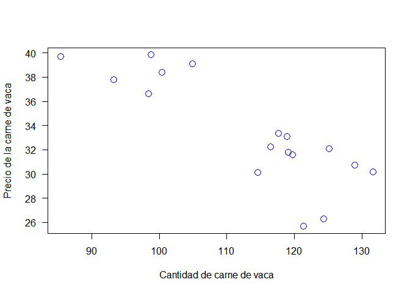<!-- -->

### Regresión lineal

Modelo de cantidad demandada de carne en función del propio precio

``` r
attach(beefdemand)
```

    ## The following object is masked _by_ .GlobalEnv:
    ## 
    ##     y

``` r
demand.qb.pb <- lm(log(qb)~log(pb))
summary(demand.qb.pb)
```

    ## 
    ## Call:
    ## lm(formula = log(qb) ~ log(pb))
    ## 
    ## Residuals:
    ##      Min       1Q   Median       3Q      Max 
    ## -0.13668 -0.05505  0.01699  0.05735  0.08972 
    ## 
    ## Coefficients:
    ##             Estimate Std. Error t value Pr(>|t|)    
    ## (Intercept)   7.3514     0.4837  15.200 1.61e-10 ***
    ## log(pb)      -0.7517     0.1380  -5.446 6.76e-05 ***
    ## ---
    ## Signif. codes:  0 '***' 0.001 '**' 0.01 '*' 0.05 '.' 0.1 ' ' 1
    ## 
    ## Residual standard error: 0.07438 on 15 degrees of freedom
    ## Multiple R-squared:  0.6641, Adjusted R-squared:  0.6417 
    ## F-statistic: 29.66 on 1 and 15 DF,  p-value: 6.756e-05

``` r
{
  plot(log(qb)~log(pb),las=1)
  abline(demand.qb.pb, col="red")
}
```

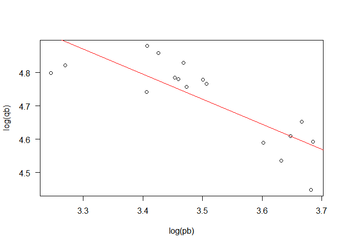<!-- -->

### Valores predichos

``` r
predict.demand <- predict(demand.qb.pb, int="predict")
```

    ## Warning in predict.lm(demand.qb.pb, int = "predict"): predictions on current data refer to _future_ responses

``` r
predict.demand
```

    ##         fit      lwr      upr
    ## 1  4.911671 4.731987 5.091355
    ## 2  4.893739 4.716883 5.070595
    ## 3  4.790052 4.624581 4.955522
    ## 4  4.720200 4.557070 4.883330
    ## 5  4.755503 4.591755 4.919251
    ## 6  4.791048 4.625512 4.956585
    ## 7  4.740902 4.577551 4.904253
    ## 8  4.750998 4.587394 4.914602
    ## 9  4.775992 4.611355 4.940630
    ## 10 4.744409 4.580981 4.907837
    ## 11 4.715450 4.552314 4.878587
    ## 12 4.644095 4.478339 4.809851
    ## 13 4.584024 4.412531 4.755517
    ## 14 4.621276 4.453706 4.788846
    ## 15 4.609631 4.440960 4.778302
    ## 16 4.595660 4.425517 4.765803
    ## 17 4.581567 4.409775 4.753359

``` r
head(predict.demand)
```

    ##        fit      lwr      upr
    ## 1 4.911671 4.731987 5.091355
    ## 2 4.893739 4.716883 5.070595
    ## 3 4.790052 4.624581 4.955522
    ## 4 4.720200 4.557070 4.883330
    ## 5 4.755503 4.591755 4.919251
    ## 6 4.791048 4.625512 4.956585

### Modelo de cantidad demandada de carne en función del propio precio y de ingreso

``` r
demand.qb.pb.y <- lm(log(qb)~log(pb)+log(y), beefdemand)
summary(demand.qb.pb.y)
```

    ## 
    ## Call:
    ## lm(formula = log(qb) ~ log(pb) + log(y), data = beefdemand)
    ## 
    ## Residuals:
    ##      Min       1Q   Median       3Q      Max 
    ## -0.13120 -0.05279  0.01940  0.05448  0.09053 
    ## 
    ## Coefficients:
    ##             Estimate Std. Error t value Pr(>|t|)    
    ## (Intercept)   6.8490     1.4379   4.763 0.000303 ***
    ## log(pb)      -0.8025     0.1970  -4.073 0.001141 ** 
    ## log(y)        0.1139     0.3057   0.372 0.715144    
    ## ---
    ## Signif. codes:  0 '***' 0.001 '**' 0.01 '*' 0.05 '.' 0.1 ' ' 1
    ## 
    ## Residual standard error: 0.07661 on 14 degrees of freedom
    ## Multiple R-squared:  0.6674, Adjusted R-squared:  0.6199 
    ## F-statistic: 14.05 on 2 and 14 DF,  p-value: 0.0004501

### Modelo de cantidad demandada de carne en función del propio precio, precio de bienes relacionados e ingreso

``` r
demand.qb.pb.pl.pp.y <- lm(log(qb)~log(pb)+log(pl)+log(pp)+log(y), beefdemand)
summary(demand.qb.pb.pl.pp.y)
```

    ## 
    ## Call:
    ## lm(formula = log(qb) ~ log(pb) + log(pl) + log(pp) + log(y), 
    ##     data = beefdemand)
    ## 
    ## Residuals:
    ##       Min        1Q    Median        3Q       Max 
    ## -0.118106 -0.040884  0.008385  0.045724  0.104486 
    ## 
    ## Coefficients:
    ##             Estimate Std. Error t value Pr(>|t|)    
    ## (Intercept)   4.6726     1.6596   2.816 0.015589 *  
    ## log(pb)      -0.8266     0.1826  -4.526 0.000695 ***
    ## log(pl)       0.1997     0.2127   0.939 0.366400    
    ## log(pp)       0.4371     0.3837   1.139 0.276806    
    ## log(y)        0.1017     0.2940   0.346 0.735437    
    ## ---
    ## Signif. codes:  0 '***' 0.001 '**' 0.01 '*' 0.05 '.' 0.1 ' ' 1
    ## 
    ## Residual standard error: 0.07016 on 12 degrees of freedom
    ## Multiple R-squared:  0.7609, Adjusted R-squared:  0.6812 
    ## F-statistic: 9.546 on 4 and 12 DF,  p-value: 0.00104

``` r
beefdemand2 <- data.frame(rbind(beefdemand,beefdemand,beefdemand))
beefdemand2
```

    ##    Year    qb   y    pb    pl    pp
    ## 1  1949 121.3 355 25.68 20.01 45.74
    ## 2  1950 124.3 380 26.30 18.74 53.00
    ## 3  1951 131.6 426 30.19 22.45 57.90
    ## 4  1952 118.9 353 33.13 27.11 56.56
    ## 5  1953 119.7 354 31.61 20.69 55.25
    ## 6  1954 114.6 361 30.15 18.89 55.69
    ## 7  1955 116.5 380 32.23 19.16 50.62
    ## 8  1956 119.1 391 31.80 20.10 52.36
    ## 9  1957 128.9 380 30.76 20.60 53.96
    ## 10 1958 125.1 368 32.08 19.46 51.78
    ## 11 1959 117.6 385 33.34 17.90 51.01
    ## 12 1960  98.4 403 36.66 17.86 54.64
    ## 13 1961  85.4 406 39.71 19.14 53.04
    ## 14 1962  93.3 411 37.79 18.03 49.47
    ## 15 1963 100.4 427 38.38 18.82 53.70
    ## 16 1964 104.9 459 39.10 19.04 55.22
    ## 17 1965  98.8 469 39.84 20.63 56.03
    ## 18 1949 121.3 355 25.68 20.01 45.74
    ## 19 1950 124.3 380 26.30 18.74 53.00
    ## 20 1951 131.6 426 30.19 22.45 57.90
    ## 21 1952 118.9 353 33.13 27.11 56.56
    ## 22 1953 119.7 354 31.61 20.69 55.25
    ## 23 1954 114.6 361 30.15 18.89 55.69
    ## 24 1955 116.5 380 32.23 19.16 50.62
    ## 25 1956 119.1 391 31.80 20.10 52.36
    ## 26 1957 128.9 380 30.76 20.60 53.96
    ## 27 1958 125.1 368 32.08 19.46 51.78
    ## 28 1959 117.6 385 33.34 17.90 51.01
    ## 29 1960  98.4 403 36.66 17.86 54.64
    ## 30 1961  85.4 406 39.71 19.14 53.04
    ## 31 1962  93.3 411 37.79 18.03 49.47
    ## 32 1963 100.4 427 38.38 18.82 53.70
    ## 33 1964 104.9 459 39.10 19.04 55.22
    ## 34 1965  98.8 469 39.84 20.63 56.03
    ## 35 1949 121.3 355 25.68 20.01 45.74
    ## 36 1950 124.3 380 26.30 18.74 53.00
    ## 37 1951 131.6 426 30.19 22.45 57.90
    ## 38 1952 118.9 353 33.13 27.11 56.56
    ## 39 1953 119.7 354 31.61 20.69 55.25
    ## 40 1954 114.6 361 30.15 18.89 55.69
    ## 41 1955 116.5 380 32.23 19.16 50.62
    ## 42 1956 119.1 391 31.80 20.10 52.36
    ## 43 1957 128.9 380 30.76 20.60 53.96
    ## 44 1958 125.1 368 32.08 19.46 51.78
    ## 45 1959 117.6 385 33.34 17.90 51.01
    ## 46 1960  98.4 403 36.66 17.86 54.64
    ## 47 1961  85.4 406 39.71 19.14 53.04
    ## 48 1962  93.3 411 37.79 18.03 49.47
    ## 49 1963 100.4 427 38.38 18.82 53.70
    ## 50 1964 104.9 459 39.10 19.04 55.22
    ## 51 1965  98.8 469 39.84 20.63 56.03

``` r
attach(beefdemand2)
```

    ## The following object is masked _by_ .GlobalEnv:
    ## 
    ##     y

    ## The following objects are masked from beefdemand:
    ## 
    ##     pb, pl, pp, qb, y, Year

``` r
demand.qb.pb.pl.pp.y <- lm(log(qb)~log(pb)+log(pl)+log(pp)+log(y), beefdemand2)
summary(demand.qb.pb.pl.pp.y)
```

    ## 
    ## Call:
    ## lm(formula = log(qb) ~ log(pb) + log(pl) + log(pp) + log(y), 
    ##     data = beefdemand2)
    ## 
    ## Residuals:
    ##       Min        1Q    Median        3Q       Max 
    ## -0.118106 -0.040884  0.008385  0.045724  0.104486 
    ## 
    ## Coefficients:
    ##             Estimate Std. Error t value Pr(>|t|)    
    ## (Intercept)  4.67258    0.84764   5.512 1.55e-06 ***
    ## log(pb)     -0.82657    0.09329  -8.860 1.65e-11 ***
    ## log(pl)      0.19968    0.10865   1.838   0.0725 .  
    ## log(pp)      0.43714    0.19597   2.231   0.0306 *  
    ## log(y)       0.10167    0.15015   0.677   0.5017    
    ## ---
    ## Signif. codes:  0 '***' 0.001 '**' 0.01 '*' 0.05 '.' 0.1 ' ' 1
    ## 
    ## Residual standard error: 0.06207 on 46 degrees of freedom
    ## Multiple R-squared:  0.7609, Adjusted R-squared:  0.7401 
    ## F-statistic: 36.59 on 4 and 46 DF,  p-value: 9.448e-14

### Uso de la librería CAR sobre análisis de regresión (CAR: Companion to Appied Regression, Fox & Weisberg (2011))

``` r
require(car)
```

### Estimación de un modelo no lineal

Ejemplo de tasa de captura de atun. Fuente: Verzani, J. (2005). Using R
for introductory statistics, pag. 353

``` r
require(UsingR)
```

    ## Loading required package: UsingR

    ## Loading required package: MASS

    ## Loading required package: HistData

    ## Loading required package: Hmisc

    ## Loading required package: Formula

    ## Loading required package: ggplot2

    ## 
    ## Attaching package: 'Hmisc'

    ## The following objects are masked from 'package:base':
    ## 
    ##     format.pval, units

    ## 
    ## Attaching package: 'UsingR'

    ## The following object is masked from 'package:survival':
    ## 
    ##     cancer

En la librería UsingR se encuentra la base de datos yellowfin

``` r
with(yellowfin, plot(count~year, las=1))
```

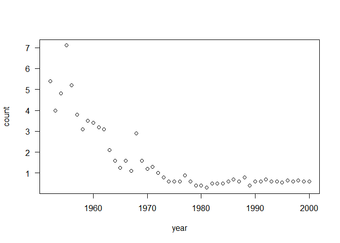<!-- -->

Definición de una función en R que sea razonable para la figura de count
versus year

``` r
model <- function (t,N,r,d)  N*(exp(-r*(t-1952))*(1-d)+d)
```

Graficando el modelo con valores de partida arbitrarios

``` r
{with(yellowfin, plot(count~year, las=1))
curve(model(x, N=6, r=1/10, d=0.1), add=TRUE, col="blue", lwd=1.5)}
```

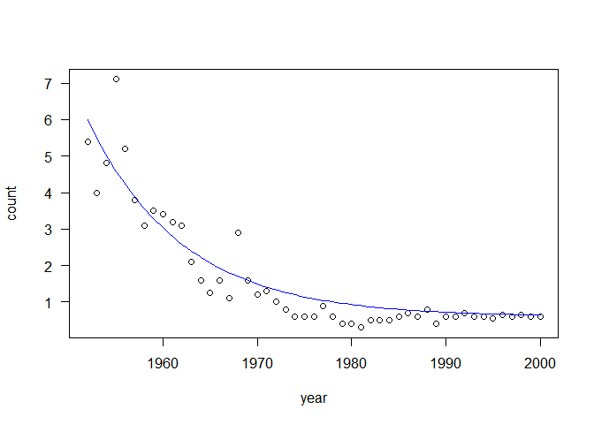<!-- -->

### Regresión no lineal

``` r
reg.yellow <- nls(count~model(year,N,r,d), start=c(N=6, r=1/10, d=0.1), data=yellowfin)
reg.yellow
```

    ## Nonlinear regression model
    ##   model: count ~ model(year, N, r, d)
    ##    data: yellowfin
    ##       N       r       d 
    ## 6.02019 0.09380 0.05359 
    ##  residual sum-of-squares: 15.48
    ## 
    ## Number of iterations to convergence: 8 
    ## Achieved convergence tolerance: 3.061e-06

``` r
{
  with(yellowfin, plot(count~year, las=1))
  curve(model(x, N=6.02, r=0.0939, d=0.0539), add=TRUE, lty=2, lwd=2, col="red")
  legend(1970, 6, legend=c("modelo exploratorio","modelo exponencial"), lty=1:2,
         col=c("blue","red"))
}
```

<!-- -->

#### Estimación de un modelo no lineal

Ejemplo de Sea urchin growth. Fuente: Verzani, J. (2005). Using R for
introductory statistics, pag. 354-356 Sea urchins are herbivores of
temperate marine ecosystems worldwide. Unlike other sessile benthic
invertebrates, sea urchins can persist at high population density when
resources are limited owing to their plastic allocation of resources.

En la librería UsingR se encuentra la base de datos urchin.growth

``` r
with(urchin.growth, plot(jitter(size)~jitter(age), las=1, 
                         xlab="age", ylab="size",main="Urchin growth by age"))
```

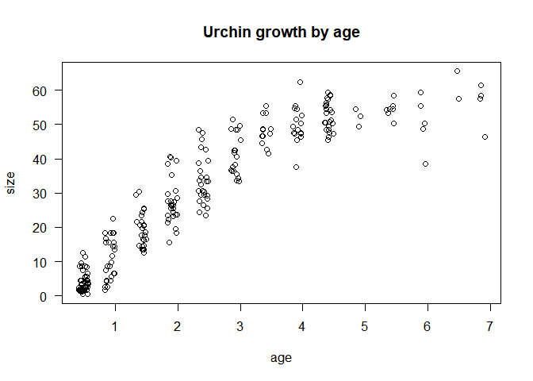<!-- -->

### Some models for growth: logistic and Richards

#### Logistic function

``` r
logistic <- function(t,Y,k,t0)  Y*(1+exp(-k*(t-t0)))^(-1)
```

``` r
{
  with(urchin.growth, plot(jitter(size)~jitter(age), las=1, 
                         xlab="age", ylab="size",main="Urchin growth by age"))
  curve(logistic(x, Y=60, k=1, t0=2), add=TRUE, col="blue", lwd=1.5)
}
```

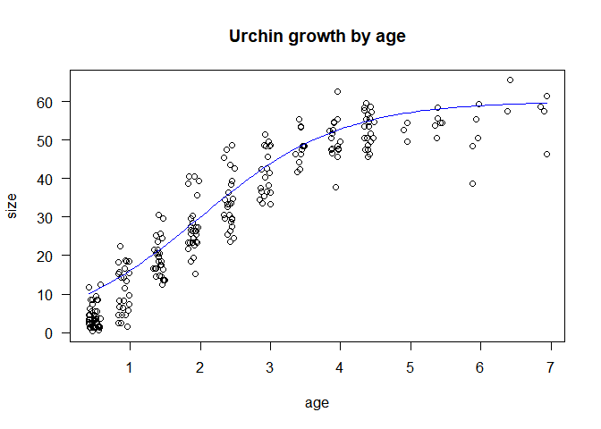<!-- -->

#### Fitting the logistic model using NLS

``` r
model.logistic <- nls(size ~ logistic(age,Y,k,t0), start=c(Y=60, k=1, t0=2),
                      data = urchin.growth)
model.logistic
```

    ## Nonlinear regression model
    ##   model: size ~ logistic(age, Y, k, t0)
    ##    data: urchin.growth
    ##      Y      k     t0 
    ## 53.903  1.393  1.958 
    ##  residual sum-of-squares: 7299
    ## 
    ## Number of iterations to convergence: 5 
    ## Achieved convergence tolerance: 6.892e-06

``` r
{
  with(urchin.growth, plot(jitter(size)~jitter(age), las=1, 
                         xlab="age", ylab="size",main="Urchin growth by age"))
  curve(logistic(x, Y=53.903, k=1.393, t0=1.958), add=TRUE, col="red", lwd=1.5)
}
```

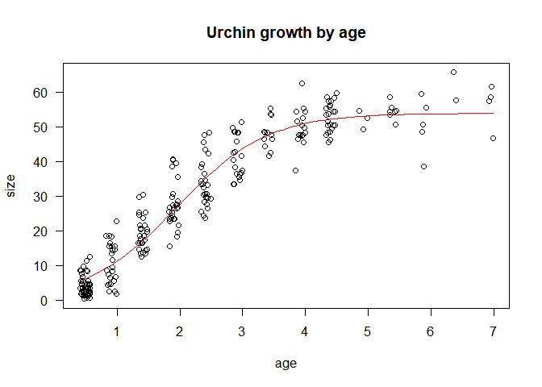<!-- -->

``` r
AIC(model.logistic)
```

    ## [1] 1560.963

### Richards function

``` r
Richards <- function(t,Y,k,t0,m){
              Y*(1-exp(-k*(t-t0)))^(m)} 
```

``` r
{
  with(urchin.growth, plot(jitter(size)~jitter(age), las=1, 
                         xlab="age", ylab="size",main="Urchin growth by age"))
  curve(Richards(x, Y=53.903, k=1.393, t0=1.958, m=1), add=TRUE, col="green", lwd=1.5)
}
```

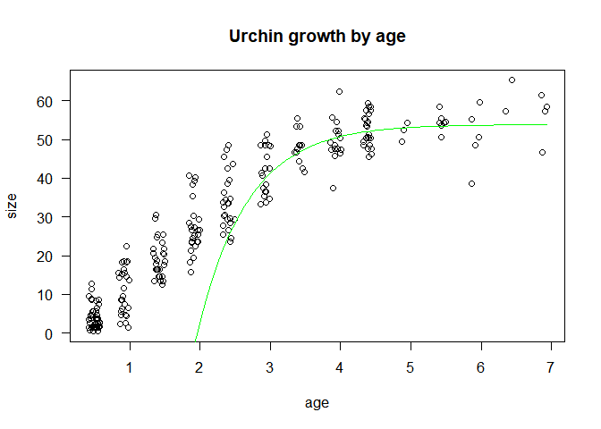<!-- -->

Genera *missing values*

``` r
model.Richards <- nls(size ~ Richards(age,Y,k,t0,m), start=c(Y=53, k=1.393, 
                            t0=1.958, m=1), data = urchin.growth)
```

    ## Error in numericDeriv(form[[3L]], names(ind), env): Missing value or an infinity produced when evaluating the model

Changing \(t_0\) AND k values

``` r
model.Richards <- nls(size ~ Richards(age,Y,k,t0,m), start=c(Y=53, k=0.5, 
                            t0=0, m=1), data = urchin.growth)
model.Richards
```

    ## Nonlinear regression model
    ##   model: size ~ Richards(age, Y, k, t0, m)
    ##    data: urchin.growth
    ##       Y       k      t0       m 
    ## 57.2649  0.7843 -0.8587  6.0636 
    ##  residual sum-of-squares: 6922
    ## 
    ## Number of iterations to convergence: 9 
    ## Achieved convergence tolerance: 1.833e-06

``` r
{
  with(urchin.growth, plot(jitter(size)~jitter(age), las=1, 
                         xlab="age", ylab="size",main="Urchin growth by age"))
  curve(Richards(x, Y=57.26, k=0.78, t0=-0.8587, m=6.0636), add=TRUE, 
      col="darkgreen", lwd=1.5, lty=2)
  legend(4,20, legend=c("Logistic", "Richards"), lty=1:2, col=c("red", "dark green"))
}  
```

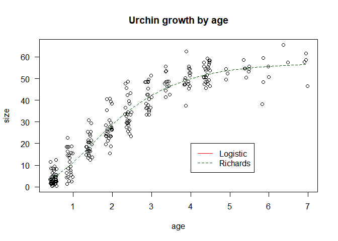<!-- -->

``` r
AIC(model.Richards)
```

    ## [1] 1549.703

### Modelos logit

*Source: Cramer, J.S. (2003). Logit Models: from Economics and other
Fields. Cambridge University Press* Los datos corresponden a posesión
privada de carro en Holanda. Variables: private car ownership status
numbered from 0 to 3 (none, used, new, more), income per equivalente
adult (calculated by counting the first adult as 1, other adults as
0.7,and children as 0.5.), household size in number of equivalente
adult, age of the head of household in five-year group (measured by
five-year classes, starting with the class ‘below 20’), the degree of
urbanization (measured on a six-point scale from countryside (1) to city
(6), and a dummy variable for the presence of a business car in the
household. A business car is a car that is primarily used for business
or professional purposes, regardless of whether it is paid for wholly or
in part by the employer or whether its costs are tax-deductible.

### Lectura de los datos, especificando los nombres de las variables

``` r
car <- read.table("Dutchcar.txt",sep=",",header=F,dec=".",
                  col.names=c("PCAR","INC","SIZE","AGE","URBA","BUSCAR"))
head(car)
```

    ##   PCAR        INC SIZE AGE URBA BUSCAR
    ## 1    2  31051.667  1.8   2    6      0
    ## 2    0  13281.250  0.8   2    6      0
    ## 3    2  21760.000  1.6  11    6      0
    ## 4    2 113391.250  0.8  12    6      0
    ## 5    1   7795.454  4.4   6    6      0
    ## 6    2  35229.000  1.0   5    6      0

``` r
attach(car)
```

    ## The following object is masked from aguas:
    ## 
    ##     AGE

Creación de un dataframe para almacenar la variable dummy para posesión
de carro, sea usado o nuevo.

``` r
carownership <-ifelse((PCAR==1|PCAR==2),1,0)
str(carownership)
```

    ##  num [1:2820] 1 0 1 1 1 1 0 1 1 0 ...

``` r
head(carownership,10)
```

    ##  [1] 1 0 1 1 1 1 0 1 1 0

``` r
plot(INC,carownership,xlab="Income",ylab="Car",las=1)
```

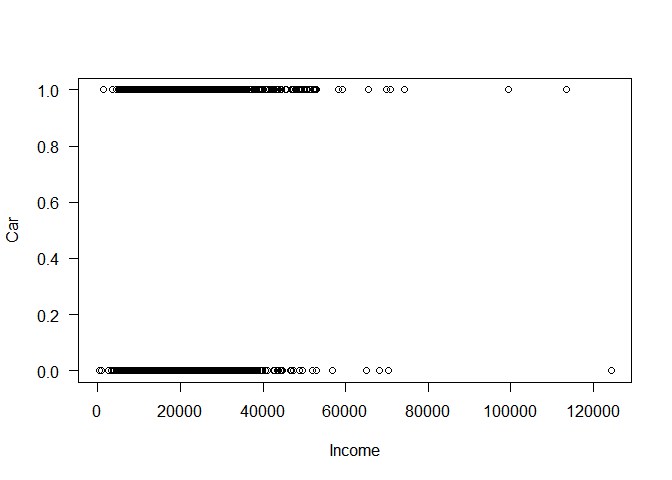<!-- -->

``` r
which(INC>120000)
```

    ## [1] 1633

``` r
car[1633,]
```

    ##      PCAR      INC SIZE AGE URBA BUSCAR
    ## 1633    3 124250.6  1.8   8    3      0

``` r
modellogit <- glm(carownership~log(INC),family=binomial)
summary(modellogit)
```

    ## 
    ## Call:
    ## glm(formula = carownership ~ log(INC), family = binomial)
    ## 
    ## Deviance Residuals: 
    ##    Min      1Q  Median      3Q     Max  
    ## -1.526  -1.302   0.995   1.053   1.272  
    ## 
    ## Coefficients:
    ##             Estimate Std. Error z value Pr(>|z|)   
    ## (Intercept) -1.86262    0.79880  -2.332   0.0197 * 
    ## log(INC)     0.22612    0.08262   2.737   0.0062 **
    ## ---
    ## Signif. codes:  0 '***' 0.001 '**' 0.01 '*' 0.05 '.' 0.1 ' ' 1
    ## 
    ## (Dispersion parameter for binomial family taken to be 1)
    ## 
    ##     Null deviance: 3837.2  on 2819  degrees of freedom
    ## Residual deviance: 3829.7  on 2818  degrees of freedom
    ## AIC: 3833.7
    ## 
    ## Number of Fisher Scoring iterations: 4
